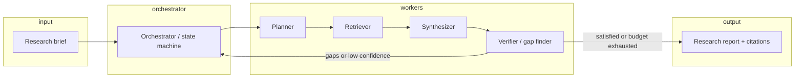

# Auto research agent — design

## 1. Purpose

An **auto research agent** takes a research question (or brief), autonomously gathers information from allowed sources, and returns a **structured answer** with **traceable evidence** (citations, links, or quoted passages). It is not a single prompt: it is a **loop** of plan → retrieve → read → update belief → stop or continue.

Success criteria:

- **Coverage**: Addresses the question without obvious gaps the user specified (e.g. time range, geography).
- **Grounding**: Claims that need evidence are tied to sources; uncertain claims are labeled.
- **Efficiency**: Bounded tool use and token budget; avoids redundant searches.
- **Safety**: Respects source policy, rate limits, and disallowed content.

## 2. Non-goals (initial version)

- Full autonomous browsing of arbitrary sites without policy.
- Replacing human judgment on high-stakes decisions (medical, legal, financial) without explicit disclaimers.
- Perfect completeness on open-ended topics (agent should report what it checked and what remains unknown).

## 3. High-level architecture

**Orchestrator** owns the run: iteration count, budget, stop conditions, and persistence of intermediate state.

**Planner** turns the brief into sub-questions, search queries, and constraints (must-include / must-avoid).

**Retriever** executes allowed tools (e.g. web search API, fetch URL, local corpus) and returns normalized **snippets** or **documents** with metadata.

**Synthesizer** merges evidence into draft sections (summary, detailed findings, open questions).

**Verifier** checks for unsupported claims, missing angles from the brief, and contradictions; emits follow-up tasks for another loop or flags human review.

## 4. Core data model

| Concept | Role |
|--------|------|
| `ResearchRun` | One end-to-end execution: id, brief, config, status, timestamps. |
| `SubQuestion` | Atomic question derived from the brief; priority and status. |
| `Evidence` | A chunk of text or structured field with `source_id`, URL, title, retrieved_at, optional quote span. |
| `Claim` | A single factual or interpretive statement linked to zero or more `Evidence` ids. |
| `Report` | Final artifact: sections, bibliography, confidence notes. |

Normalization keeps the synthesizer independent of whether evidence came from search snippets or full-page fetch.

## 5. Tooling surface (conceptual)

Minimum useful set:

1. **Search** — returns ranked results (title, URL, snippet).
2. **Fetch** — retrieve readable text from allowlisted URLs (with size/time limits).
3. **Optional: corpus / file search** — for internal or uploaded materials.

Each tool call is logged on the `ResearchRun` for audit and debugging.

## 6. Control flow and stopping

Stop when any of:

- Verifier reports **no critical gaps** and **confidence threshold** met for key claims.
- **Iteration** or **tool-call** budget exhausted.
- User-defined **deadline** or **max sources** reached.

On stop with gaps, the report must include an explicit **“Limitations”** section listing unresolved sub-questions and what was tried.

## 7. Configuration knobs

- `max_iterations`, `max_tool_calls`, `max_fetch_pages`
- Allowlist / blocklist for domains
- Model roles (planner vs synthesizer can differ)
- Citation style (inline links vs numbered refs)
- Language and depth (`brief` vs `deep`)

## 8. Risks and mitigations

| Risk | Mitigation |
|------|------------|
| Hallucinated citations | Require evidence id before stating a fact; verifier pass; optional “citation check” step |
| Infinite research loops | Hard budgets; planner must justify new queries vs repeating old |
| Copyright / ToS | Fetch only allowed sources; respect robots and API terms |
| Stale answers | Store `retrieved_at`; brief can include “as of” date |

## 9. Implementation phases

1. **Skeleton** — `ResearchRun` state machine, in-memory store, stub tools, single-model loop.
2. **Real retrieval** — Wire search + fetch with limits and logging.
3. **Structured output** — JSON schema for claims ↔ evidence; generate markdown/HTML report.
4. **Hardening** — Rate limits, retries, observability (structured logs, run replay).

## 10. Open decisions (to resolve during build)

- Runtime: CLI vs HTTP API vs library-first.
- Persistence: SQLite vs Postgres vs file-based for v1.
- Whether planner and synthesizer share one model context or separate calls.
- Human-in-the-loop: optional approval before expensive fetch waves.

---

This document is the baseline for implementation; adjust sections as the first prototype teaches what matters most.
