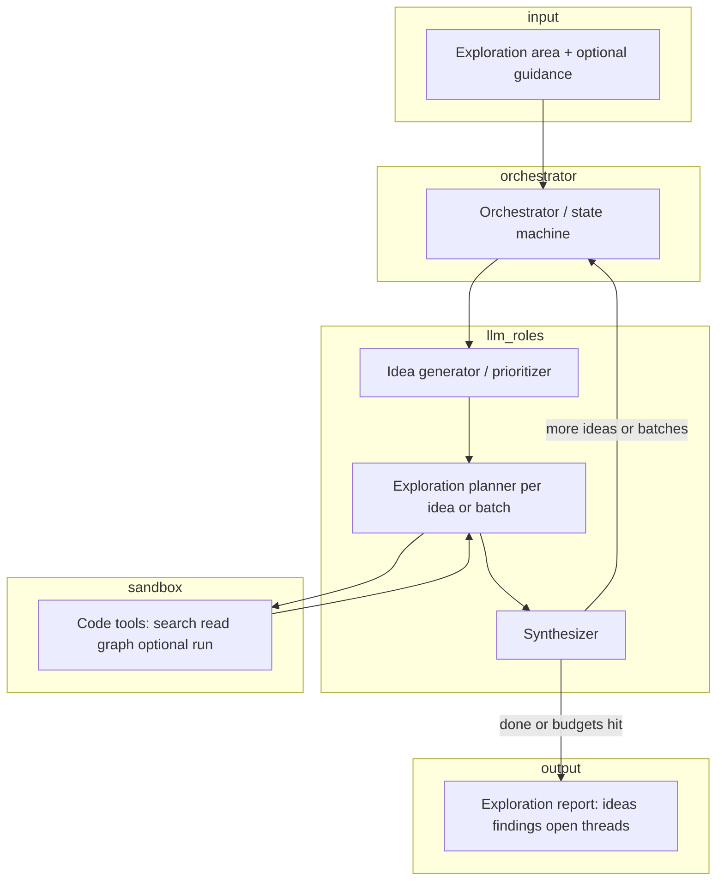

# Auto research agent — design (code exploration)

## 1. Purpose

An **auto research agent** runs **on top of a codebase**. The user specifies an **area to explore** (directory, package, subsystem, or natural-language scope). The agent is **LLM-driven**: it proposes and pursues up to **20 exploratory ideas**—hypotheses, threads, or questions about how that area works—then summarizes what it learned.

This is **not** a “grounded to external sources” system. Findings come from **reading and optionally executing code inside a sandbox**. The LLM may infer, speculate, and connect dots; the design prioritizes **useful exploration** and **clear attribution to code locations** (file/line/symbol) where the agent actually looked, not bibliographic grounding.

Success criteria:

- **Scoped**: Stays within (or clearly justifies stepping outside) the user’s exploration area.
- **Idea budget**: At most **20** tracked exploratory ideas per run unless the user raises the cap.
- **Follow-through**: Each idea gets a defined status (explored, deferred, blocked) and enough tool use to be meaningful—not only a one-line guess.
- **Sandbox safety**: No arbitrary host access; code effects confined to an isolated environment.
- **Batch-friendly**: Long-running exploration can be **split into batches** (time-sliced LLM calls, parallel workers, or queued jobs) without losing run state.

## 2. Non-goals (initial version)

- Proving correctness of the whole repo (this is exploration, not formal verification).
- Un-sandboxed execution on the developer’s machine.
- Guaranteeing completeness over the area—only systematic **attempts** within the idea and time budgets.

## 3. High-level architecture



**Orchestrator** owns the run: idea list (cap 20), batch scheduling, per-idea status, global budgets (time, tokens, tool calls), and persistence so a run can resume after a batch.

**LLM roles** (can be one model with different prompts, or split models):

- **Idea generator** — From the area + optional user guidance, proposes and ranks exploratory ideas; can merge or drop duplicates.
- **Exploration planner** — For the current idea (or a **batch** of ideas), chooses tool calls: where to read, what to search, whether to run something in the sandbox.
- **Synthesizer** — After tool results, updates notes for each idea and decides whether to deepen, move on, or spawn a follow-up idea (still under the 20 cap).

**Sandbox** exposes only **allowed tools** to the LLM; see §6.

### 3.1 Agent Brain: The LLM Reasoning Loop

The agent's "brain" is the orchestrator loop which coordinates **three specialized LLM modes** in sequence:

**Mode 1: Idea Generation & Prioritization**
- Input: exploration area description, optional user seed ideas, codebase structure summary
- Process: LLM generates 8–15 exploratory ideas ranked by likely utility and feasibility
- Output: ordered `ExploratoryIdea` records with title, hypothesis, priority (1–5), and expected effort
- Heuristics: prefer ideas that are concrete + scoped + achievable within tool budget; merge or drop redundant ideas immediately

**Mode 2: Exploration Planning (per batch)**
- Input: current queue of queued/in-progress ideas, prior `ToolTrace` results, global remaining budgets (tokens, calls, time)
- Process: for each idea (or batch of related ideas), LLM generates a **tool sequence plan**:
  - Predict which tools could answer the question (search, read, list, run)
  - Prioritize by confidence and cost (prefer cheap searches over reads; avoid expensive runs unless needed)
  - Generate structured tool invocation specs: tool name, arguments, expected finding type
- Output: ordered list of `ToolInvocation` specs (not yet executed)
- Branching logic: if the LLM thinks an idea is blocked (e.g. "need a running service"), mark it deferred and move to next idea

**Mode 3: Synthesis & Adaptation**
- Input: current idea state, all prior `ToolTrace` results for that idea, `Finding` notes accumulated so far
- Process: LLM reads tool results and updates the idea's understanding:
  - Extract key signals from output (e.g. "found 47 references to PaymentAdapter", "error: file not found")
  - Distill into human-readable `Finding` records with links to code locations
  - Decide next step: continue exploring (spawn follow-up tool calls), mark idea as explored, or defer
  - Optionally propose new child idea or replacement idea if discovery suggests a new thread
- Output: updated `ExploratoryIdea` status, new `Finding` records, optional new ideas (if under cap)

These modes cycle: Generation → batch of Planning steps → batch of Synthesis steps → repeat or finalize.

## 4. Exploratory ideas (up to 20)

An **exploratory idea** is a short, actionable thread, for example:

- “How does authentication flow from HTTP handler to session store in `auth/`?”
- “What happens if `Config.reload` is called concurrently?”
- “Who implements `PaymentAdapter` and where is it wired in DI?”

Properties:

- **Guided mode**: User may supply seed ideas, forbidden paths, or “focus on performance / errors / API surface.”
- **Unguided mode**: LLM proposes all ideas from the area description.
- **Follow-up**: Completing one idea may add a **child** or **replacement** idea; the orchestrator enforces **max 20** active-or-completed idea slots per run (configurable).

### 4.1 Idea Prioritization & Ranking

The LLM ranks ideas using these heuristics (in order of preference):

1. **Scope alignment**: Does the idea stay within or productively extend the exploration area? High priority if fully contained; lower if it requires external dependencies.
2. **Answerable with available tools**: Can we realistically search/read/run to answer it, or is it blocked (missing source, proprietary binary, no test harness)? Mark as answerable, risky, or blocked.
3. **Specificity**: Concrete questions > vague ones. "What is the structure of the DI container?" > "Does the code use dependency injection?"
4. **Unique insights**: Does this idea explore something not yet covered by prior ideas? Merge duplicates; keep novel angles.
5. **Effort estimate**: Simple searches (effort=1) before complex symbol resolution (effort=3) before running integration tests (effort=5).

Each idea is scored 1–5 (1=trivial/low value; 5=complex/high value). The orchestrator processes in descending priority order within each batch.

**Batching**:

- **Within a batch**: One LLM call plans tool use for several ideas (e.g. shared grep across related hypotheses) to save round-trips. Related ideas (same file or concept) are grouped for efficiency.
- **Across batches**: A batch ends on token/time limits; state is saved; the next batch continues with the same `ResearchRun` id. The LLM re-reads prior findings to maintain context.

## 5. Core data model

| Concept | Role |
|--------|------|
| `ResearchRun` | One exploration: area spec, config, status, timestamps, batch cursor, memory index. |
| `ExplorationArea` | Roots (paths, packages), include/exclude globs, optional natural-language hint. |
| `ExploratoryIdea` | id, title, hypothesis, priority, status (`queued`, `in_progress`, `explored`, `blocked`, `skipped`), parent idea optional. |
| `ToolTrace` | Tool name, args summary, sandbox id, duration, stdout/stderr excerpt, linked idea ids. |
| `Finding` | Free-form LLM + human-readable summary; optional pointers to symbols/files/lines (what was **read**, not a claim of external truth). |
| `ExplorationReport` | Per-idea findings, global themes, open questions, "did not look at" notes, learned memories. |
| `Memory` | Learned artifact: type (pattern/domain/connection), summary, code references, relevance score, created from findings & tool traces. |
| `MemoryIndex` | In-memory + persistent store: embeddings or keyword index for fast pattern/concept lookup. Queryable by type, scope, relevance. |

There is **no** requirement for a `Claim` ↔ `Evidence` graph tied to web citations. Optional: link findings to `ToolTrace` ids for **reproducibility** ("this note came after reading `foo.go:12–40`").

### 5.1 Memory Types & Structure

**Pattern Memory** (`type: "pattern"`):
- What it captures: Recurring code patterns, idioms, architecture styles observed in the codebase
- Example: "Dependency injection via factory pattern used in `services/container.go`; also seen in `handlers/middleware.go`"
- Fields: pattern description, locations (file:line), frequency, related ideas
- Persistence: session + repository (valuable for future runs on same codebase)

**Domain Knowledge Memory** (`type: "domain"`):
- What it captures: Business logic, service responsibility, module purpose, relationships between components
- Example: "PaymentService handles all payment transactions; integrates with StripeAdapter and PayPalAdapter"
- Fields: concept name, description, related symbols/files, dependencies, business significance
- Persistence: session + repository (helps onboard to codebase)

**Connection Memory** (`type: "connection"`):
- What it captures: How discoveries relate to each other; causal or data-flow relationships; cross-cutting concerns
- Example: "Authentication (auth/) → SessionStore (redis/) → UserService (services/). Failed auth clears session via Redis listener."
- Fields: source component, target component, relationship type (calls, depends-on, publishes-to), confidence
- Persistence: session + repository (maps codebase topology)

**Tool Effectiveness Memory** (`type: "tool_signal"`, session-only):
- What it captures: Which tools proved most effective for certain question categories
- Example: "To find implementations: resolve-symbol more efficient than search; 3 avg calls vs 8 avg calls"
- Fields: question type, tool sequence, success rate, avg cost (calls/tokens)
- Persistence: session (useful for current run's planning decisions)

## 6. Sandbox

Goals: **confine** what the agent can do while still allowing meaningful code exploration.

Recommended properties:

- **Filesystem**: Read-only mount of the **repository snapshot** (or copy) used for the run; optional writable **scratch** directory inside the sandbox only.
- **Network**: **Off** by default, or allowlist only what’s strictly needed (e.g. none for pure static exploration).
- **Execution**: If the agent runs tests, scripts, or small repro snippets, they run **inside** the sandbox with CPU/memory/time **cgroups** (or container equivalent) and **no** access to host secrets, SSH keys, or cloud metadata.
- **Determinism (best effort)**: Pinned tool versions, clear env vars, logged commands.

The LLM **never** receives raw shell; it issues **structured tool invocations** that the runtime validates and maps to sandboxed commands.

## 7. Tooling surface (code-first)

Typical tools (names illustrative):

1. **Find in codebase** — Ripgrep-like search scoped to `ExplorationArea`.
2. **Read file / range** — Bounded line or byte ranges to avoid huge dumps.
3. **List directory / module outline** — Summaries or tree within scope.
4. **Resolve symbol** — Jump to definition / references when backed by LSP or ctags (optional phase).
5. **Run in sandbox** — e.g. `go test ./pkg/foo -run TestBar -count=1` with timeout; capture output only.

Each tool call is recorded on the run for debugging and for “what we actually looked at” sections in the report.
### 7.1 Tool Selection Strategy

The exploration planner uses a **greedy heuristic** to select tools:

**Cost ranking** (cheap to expensive):
1. **Search** (grep/ripgrep): ~1 tool call, minimal tokens to parse output; fast; good for "does X exist?"
2. **List** (directory/module tree): ~1 call; low token cost; good for structure discovery
3. **Read file** (single range): ~1 call; medium tokens; good for detailed inspection
4. **Resolve symbol**: ~2–5 calls (definition + references); higher token cost; good for dependency tracing
5. **Run command**: ~1 call; variable time/resource; reserved for testing, validation, or edge cases

**Decision tree** for each exploratory idea:

```
Question: "Does X exist or how is X implemented?"
├─ Search first: ripgrep for X, class name, function name
│  ├─ If found → read relevant file ranges
│  └─ If not found → mark idea as blocked with reason
├─ List structure: if unclear where X lives, list parent directories
│  └─ Refine search scope and rerun search
├─ Resolve symbols: if need to trace X to its definition or dependents
│  └─ Follow references, read function bodies
└─ Run test/validation: if X's behavior needs confirmation
   └─ Execute with bounded timeout and capture output
```

**Batching tool calls**:
- Group related searches (e.g. all payment-related searches) into one batch to reduce round-trips
- Re-use prior search results to avoid redundant tool calls
- Track tool call count toward per-idea budget; stop idea if exhausted before finding answer

### 7.2 Tool Examples & Expected Outputs

**Example 1: Answering "How does authentication flow from handler to session store?"**

Sequence:
1. **Search**: `ripgrep --type=go "session.*store"` 
   - Output: 12 matches in `auth/session.go` and `handlers/auth.go`
   - Cost: 1 tool call, 50 tokens
2. **List**: Show structure of `auth/` directory 
   - Output: files `session.go`, `jwt.go`, `middleware.go`, `types.go`
   - Cost: 1 tool call, 20 tokens
3. **Read**: Get lines from `handlers/auth.go:45–80` (handler code) and `auth/session.go:10–40` (store init)
   - Output: ~200 lines of context
   - Cost: 2 tool calls, 300 tokens
4. **Resolve symbols**: Trace `SessionStore` interface definition and implementations
   - Output: interface at `auth/session.go:15`, implementations in `redis/store.go`
   - Cost: 2 tool calls, 200 tokens
5. **Result Finding**: "HTTP handler authenticates via JWT in `middleware`, stores session in `SessionStore` interface backed by Redis implementation in `auth/session.go:12–25`."
   - Total cost: 6 tool calls, 570 tokens

**Example 2: Answering "What happens if `Config.reload` is called concurrently?"**

Sequence:
1. **Search**: Find `Config.reload` definition 
   - Output: found in `config/manager.go:88`
   - Cost: 1 tool call, 40 tokens
2. **Read**: Read the reload method implementation (~30 lines)
   - Output: shows RWMutex lock pattern
   - Cost: 1 tool call, 150 tokens
3. **Search**: Find all callers of `Config.reload` 
   - Output: 8 matches, mostly in tests and startup code
   - Cost: 1 tool call, 60 tokens
4. **Search**: Look for concurrency primitives in config package (mutexes, channels)
   - Output: found RWMutex on line 20
   - Cost: 1 tool call, 40 tokens
5. **Run**: Execute `go test ./config -run TestReloadConcurrent -count=10` in sandbox
   - Output: all tests passed, no race detector warnings
   - Cost: 1 tool call, 3 seconds, 100 tokens
6. **Result Finding**: "Reload is protected by RWMutex; concurrent calls serialize; no races detected in test suite. Safe for concurrent use."
   - Total cost: 5 tool calls, 390 tokens, 3 seconds execution

**Example 3: Answering "Who implements `PaymentAdapter` and where is it wired in DI?"**

Sequence:
1. **Search**: Find `PaymentAdapter` interface 
   - Output: found in `payment/adapter.go:15`
   - Cost: 1 tool call, 30 tokens
2. **Read**: Get interface definition
   - Output: 15 lines defining interface methods
   - Cost: 1 tool call, 80 tokens
3. **Resolve symbols**: Get all implementations of `PaymentAdapter` 
   - Output: 3 results: `StripeAdapter`, `PayPalAdapter`, `MockAdapter`
   - Cost: 1 tool call, 120 tokens
4. **Search**: Find DI container wiring 
   - Output: found adapter registration in `main.go:45` and `services/container.go:120`
   - Cost: 1 tool call, 50 tokens
5. **Read**: Read DI container code and factory functions
   - Output: ~50 lines showing registration
   - Cost: 1 tool call, 200 tokens
6. **Result Finding**: "PaymentAdapter is an interface in `payment/adapter.go`. Implementations: StripeAdapter (prod), PayPalAdapter (prod), MockAdapter (tests). Wired in `services/container.go:42–60` via factory registration function."
   - Total cost: 5 tool calls, 480 tokens

## 8. Agent Decision-Making Loop

The orchestrator's core loop cycles through three phases to systematically explore ideas:

### 8.1 High-Level Loop Pseudocode (Reason → Act → Learn → Memorize)

```
ResearchRun run = load_or_create_run(exploration_area)
run.memory_index = load_or_init_memory_index(exploration_area)

while not run.is_complete():
  
  # PHASE 1: REASON — Generate & Prioritize Ideas
  if len(run.ideas) < max_ideas and run.idea_queue_empty():
    # Inject memory context: recent patterns and domain knowledge
    memory_context = run.memory_index.query(
      types=["pattern", "domain", "connection"],
      limit=10,
      codebase_area=run.area
    )
    new_ideas = llm.generate_ideas(
      area=run.area,
      seed_ideas=run.user_seed_ideas,
      prior_findings=run.all_findings,
      memory_context=memory_context,  # NEW: inform idea generation
      max_to_generate=max_ideas - len(run.ideas)
    )
    run.ideas.extend(rank_by_priority(new_ideas))
  
  # PHASE 2: ACT — Plan & Execute
  current_batch = run.get_next_idea_batch(batch_size=5)
  if not current_batch:
    break  # No more ideas to explore
  
  tool_plans = llm.plan_exploration(
    ideas=current_batch,
    prior_tool_traces=run.tool_traces,
    memory_index=run.memory_index,  # NEW: avoid redundant tool calls
    remaining_budget={
      token_budget: run.remaining_tokens,
      tool_call_budget: run.remaining_tool_calls,
      wall_clock_budget: run.remaining_time
    }
  )
  
  # Execute tools and continuously learn
  for tool_invocation in tool_plans:
    trace = execute_tool_in_sandbox(tool_invocation)
    run.tool_traces.append(trace)
    update_idea_status(tool_invocation.idea_id, "in_progress")
    
    # PHASE 3a: LEARN (micro-learning after each tool)
    if should_learn_from_trace(trace):  # heuristic: interesting output?
      micro_memories = llm.extract_learnings(
        tool_trace=trace,
        idea=get_idea_by_id(tool_invocation.idea_id),
        existing_patterns=run.memory_index.query_patterns(limit=5)
      )
      for memory in micro_memories:
        run.memory_index.add_memory(memory)
  
  # PHASE 3b: SYNTHESIZE & LEARN per idea
  for idea in current_batch:
    findings = llm.synthesize_findings(
      idea=idea,
      tool_traces_for_idea=run.get_traces_for_idea(idea.id),
      prior_findings=idea.findings,
      memory_context=run.memory_index.query(idea=idea)  # NEW: contextualize
    )
    idea.findings.extend(findings)
    
    # PHASE 3c: LEARN from findings (synthesis-level learning)
    idea_memories = llm.synthesize_memories(
      findings=findings,
      tool_traces=run.get_traces_for_idea(idea.id),
      idea=idea
    )
    for memory in idea_memories:
      run.memory_index.add_memory(memory)
    
    # Decide next action for this idea
    decision = llm.decide_next_action(idea=idea)
    match decision:
      case "continue_exploring":
        idea.status = "in_progress"
      case "mark_explored":
        idea.status = "explored"
      case "spawn_child_idea":
        if len(run.ideas) < max_ideas:
          child = decision.child_idea
          child.parent_id = idea.id
          run.ideas.append(child)
      case "mark_blocked":
        idea.status = "blocked"
        idea.block_reason = decision.reason
  
  # PHASE 4: MEMORIZE — Consolidate & Persist
  run.memory_index.consolidate()  # Deduplicate, merge similar memories
  persist_memory_checkpoint(run.memory_index, run.id)  # Save to disk
  
  # Phase 5: Check budgets and decide whether to continue
  if is_budget_exhausted(run):
    run.status = "budget_exhausted"
    persist_run_state(run)
    break

# Finalization: Final memorization pass
consolidated_memories = llm.synthesize_run_learnings(
  all_findings=run.all_findings,
  memory_index=run.memory_index,
  exploration_area=run.area
)
for memory in consolidated_memories:
  run.memory_index.add_memory(memory, persist=True)

report = generate_report(run, final_memories=run.memory_index.list_all())
return report
```

### 8.2 Decision Heuristics at Each Phase

**After executing tools (Phase 3):**
- If tool succeeded and returned useful data: mark idea as "making progress"
- If tool failed (e.g. search returned no results): either defer, try different search, or mark blocked
- If tool output is ambiguous: add a follow-up idea or request a different tool

**Synthesizer decision (Phase 4):**
- **Continue exploring**: if findings are incomplete (e.g. found interface but not all implementations) or question not yet answered
- **Mark explored**: if enough signal to answer the question with confidence ≥ 70%, or tool budget for idea exhausted
- **Spawn child idea**: if discovery reveals important follow-up (e.g. "authentication issue mentioned in code; worth exploring separately")
- **Mark blocked**: if tools consistently fail or idea requires unavailable resource (e.g. "need running database")

**Budget decisions (Phase 5):**
- If tokens exhausted: persist state, return with incomplete run; can resume in next batch
- If tool calls exhausted: stop current batch and finalize
- If wall-clock exhausted: persist and return interim results

### 8.3 Learning & Memorization Stage (Continuous & Final)

The agent learns and memorizes at **three granularity levels** to build reusable knowledge:

**Micro-learning (after each tool execution):**
- Occurs immediately after a tool trace is captured
- LLM extracts **one or two high-confidence short signals** from tool output
- Examples:
  - Search returns 47 matches → "PaymentAdapter is heavily used across payment/ and orders/ packages"
  - File read shows interface + 3 implementations → "PaymentAdapter pattern: interface + concrete implementations"
- Stored as: quick snippet in session memory; checked for deduplication before adding
- Goal: Capture raw observations before context is lost

**Idea-level learning (after synthesis):**
- After findings are synthesized for an idea, LLM distills learnings
- Connects observations across multiple tool traces: "Tool A found X, Tool B confirmed Y, together they show pattern Z"
- Examples:
  - "DI pattern: interfaces registered in container, injected via constructor"
  - "Auth flow: handler → middleware → session store → redis backend"
- Stored as: `Connection` or `Pattern` memories linking multiple code locations
- Goal: Build causal understanding, not just isolated observations

**Final synthesis (end of run):**
- After all ideas are explored, LLM reviews **all memories + all findings** to identify:
  - **Emerging themes** ("3 ideas discovered factory patterns; indicates design preference")
  - **Cross-cutting patterns** ("Concurrency protection via RWMutex appears in 5 packages")
  - **Architecture insights** ("Hexagonal architecture: handlers → services → adapters → external")
- Produces high-level, confidence-ranked memories
- Stored as: persistent repository memories (survives across runs)
- Goal: Build mental models of codebase structure and conventions

### 8.3.1 Memory Index & Query Strategy

**In-memory index** (per run):
- Flat list of memories created during the run
- Quick lookup by type (pattern, domain, connection)
- Deduplicated: before adding, check if similar memory exists (fuzzy text match); merge if match confidence > 80%

**Persistent index** (repository-scoped):
- Stored on disk as JSON or SQLite (configurable)
- File: `.research-agent/memory-index.json` in the codebase root
- Contains all memories from prior runs on this codebase; tagged with commit SHA
- Supports queries: "Give me all patterns related to DI", "What do we know about auth/", etc.

**Query during planning:**
- Planner queries memory: "Have we already explored this component before?"
- If yes: retrieve prior findings and avoid redundant tool calls
- Example: "User asks how X connects to Y. Memory shows we already traced this in idea #3. Reuse those findings instead of running search again."

**Query during idea generation:**
- Generator queries: "What patterns and domain knowledge should I use to propose new ideas?"
- Returns top-10 most relevant memories by relevance score
- Shapes idea proposals: suggests follow-up ideas that naturally extend prior learnings

### 8.3.2 Memory Lifecycle & Persistence

**Creation:**
- `extract_learnings()` LLM call after tool execution → micro-memories
- `synthesize_memories()` LLM call after idea synthesis → mid-grain memories
- `synthesize_run_learnings()` LLM call at end of run → high-grain memories

**Deduplication & Merging:**
- During `run.memory_index.consolidate()`: compare all session memories
- If two memories are > 80% similar (embedding distance or keyword overlap), merge them
- Keep the most comprehensive version; increment "observed count"

**Persistence Strategy:**
- Session memories: stored in `run.session_memory` (volatile, lost after run)
- Repository memories: persisted to `.research-agent/memory-index.json` after each batch
- Before persisting: filter out low-confidence memories (< 60% confidence)
- Tag with: commit SHA, codebase area, creation timestamp, source (idea id + tool trace id)

**Cross-run Querying:**
- On next run of the same codebase: load `.research-agent/memory-index.json` first
- Memories valid if same commit SHA (or user confirms they are still relevant for different SHA)
- If commit changed: mark memories as "may be stale"; use with caution

### 8.3.3 Learning Examples

**Example 1: Micro-learning (single tool trace)**

Tool trace:
```
search("PaymentAdapter") → 47 matches:
  - payment/adapter.go:15
  - orders/payment.go:82
  - handlers/checkout.go:120
  - ... (44 more)
```

Extracted micro-memory:
```
Memory {
  type: "domain",
  summary: "PaymentAdapter is heavily referenced; core abstraction in payment domain",
  locations: ["payment/adapter.go:15"],
  reference_count: 47,
  confidence: 0.95,
  source_trace_id: "trace_12345",
  created_at: "2026-04-06T10:15:00Z"
}
```

**Example 2: Idea-level learning (synthesis)**

Findings from idea "How does auth flow from handler to session store?":
```
- Tool A (search): Found auth middleware in handlers/middleware.go
- Tool B (read): Middleware calls SessionStore methods
- Tool C (resolve): SessionStore is interface in auth/session.go:15
- Tool D (read): Redis implementation in redis/store.go
- Tool E (search): SessionStore created in services/container.go
```

Synthesized connection memory:
```
Memory {
  type: "connection",
  summary: "Auth flow: HTTP handler → middleware (handlers/middleware.go:50) → SessionStore interface (auth/session.go:15) → Redis backend (redis/store.go:20)",
  components: [
    {name: "Handler", file: "handlers/auth.go", line: 40},
    {name: "Middleware", file: "handlers/middleware.go", line: 50},
    {name: "SessionStore interface", file: "auth/session.go", line: 15},
    {name: "Redis impl", file: "redis/store.go", line: 20}
  ],
  relationship: "data flow: request → auth check → session store",
  confidence: 0.92,
  source_idea_ids: ["idea_001"],
  source_trace_ids: ["trace_14", "trace_15", "trace_16"],
  created_at: "2026-04-06T10:20:00Z"
}
```

**Example 3: Final synthesis (end of run)**

After exploring 15 ideas, LLM reviews all 12 session memories + all prior repository memories:

Emergent high-grain memory:
```
Memory {
  type: "pattern",
  summary: "Hexagonal architecture pattern: domain (auth/, payment/, orders/) → services (DI container) → adapters (external APIs) → infrastructure (redis/, db/)",
  instances: [
    "AuthService → JwtAdapter → Firebase",
    "PaymentService → StripeAdapter → Stripe API",
    "OrderService → InventoryAdapter → Inventory System"
  ],
  confidence: 0.88,
  observed_across_ideas: ["idea_001", "idea_003", "idea_007", "idea_012", "idea_015"],
  architectural_significance: "HIGH",
  created_at: "2026-04-06T10:45:00Z"
}
```

## 9. Control flow and stopping

Stop when any of:

- All ideas are **explored**, **skipped**, or **blocked** (with reason).
- **Idea cap** reached and the synthesizer chooses to finalize.
- **Global budget** exhausted: wall-clock, LLM tokens, or tool calls.
- User **abort**.

Blocked ideas (e.g. binary-only dependency, missing sandbox image) should still appear in the report with explanation.

### 8.3 Per-Idea Stopping Heuristics

The synthesizer uses the following signals to decide when to stop exploring an individual idea:

**Confidence-based stopping** (default for answerable ideas):
- If findings answer ≥ 70% of the question with high confidence: mark explored
- Example: "Who implements PaymentAdapter?" → Found 3 implementations + 5 references → stop
- Example: "How does auth flow?" → Found handler, store, middleware connections → stop

**Evidence-based stopping**:
- Found relevant code, read it, understood behavior
- Ran related tests or validation, results shown expected behavior
- Question is sufficiently scoped that further exploration would be diminishing returns

**Tool budget exhaustion** (per-idea soft limit):
- If idea has already consumed 5+ tool calls and findings are incomplete: offer to defer
- If tool budget is < 2 calls remaining globally: stop idea even if incomplete
- Record in finding: "Incomplete due to tool budget exhaustion"

**Blocking conditions** (mark as blocked, not explored):
- Tool errors consistently (e.g. search returns empty, file not found)
- Prerequisite not met (e.g. "need running database", "binary-only dependency", "missing source code")
- External resource required (e.g. API key, network access outside sandbox)
- Record block_reason; include in report as "could not explore because..."

**Deferred status** (optional intermediate state):
- If idea is answerable but expensive: mark as "deferred" rather than blocked
- Resume in next batch if room in budget
- Useful for: complex symbol resolution, expensive test runs, multi-file traces

## 10. Configuration knobs

- `max_exploratory_ideas` (default **20**)
- `batch_max_tokens`, `batch_wall_clock_seconds`, `max_tool_calls_per_idea`
- Sandbox: CPU, memory, timeout per command, network policy
- `exploration_depth` (shallow outline vs deep traces)
- Guided vs unguided; optional user **seed ideas** list

### 9.1 LLM-Specific Configuration

- **Model selection**: Which LLM for each role (idea generator, planner, synthesizer)? Can be same model with different prompts or different models.
- **Temperature**: Default 0.7 for idea generation (creative), 0.3 for planning (deterministic), 0.5 for synthesis (balanced)
- **Max tokens per call**: Default 2000 for generation, 1500 for planning, 2500 for synthesis; overridable per role
- **Context window strategy**: For synthesis, include prior findings + recent tool traces (truncate if necessary); do not include raw file contents > 5KB
- **Prompt templates**: Load from `/prompts/` directory; allow override per run
- **Tool validation**: LLM responses must produce valid structured tool invocation specs; reject malformed or out-of-policy requests

### 9.2 Tool Execution Configuration

- **Search timeout**: Default 10 seconds; fail fast if pattern too broad
- **Read file limit**: Default 50KB per read; split large files into ranges
- **List depth limit**: Default 3 levels deep; summarize if deeper
- **Run timeout**: Default 5 seconds per command in sandbox; can override per command
- **Run resource limits**: 512MB memory, 1 CPU, no network by default

## 11. Risks and mitigations

| Risk | Mitigation |
|------|------------|
| LLM invents file paths or APIs | Tools return errors; planner must reconcile; report distinguishes “observed” vs “inferred” |
| Prompt injection via repo content | Treat file contents as data; separate system policy; no instruction-following from files |
| Sandbox escape | Hardened container, no host mounts, no CAP_SYS_ADMIN, minimal image |
| Runaway cost | Hard caps on ideas, batches, and tool calls; resume requires explicit continuation if desired |
| Stale snapshot | Label report with commit SHA / snapshot id used for the run |

## 12. Implementation phases

1. **Skeleton** — `ResearchRun` + idea list + orchestrator loop; stub tools returning fake snippets; no sandbox yet (read-only local path with strict path validation as interim).
2. **Real code tools** — Scoped search + read + list; structured traces.
3. **Sandbox execution** — Container (or equivalent) for run commands; scratch workspace.
4. **Batching & resume** — Persist state between batches; optional parallel exploration of independent ideas with shared global budget.
5. **Polish** — Optional LSP/symbol tools; CLI or API; structured JSON report export.

## 13. Open decisions (to resolve during build)

- Sandbox technology (Docker, Podman, Firecracker, gVisor, etc.) vs “strict read-only + no exec” for v1.
- Single monolithic LLM thread vs **parallel** workers per idea (under a global semaphore).
- How much of the **20 ideas** to plan upfront vs discover incrementally.
- Report format: markdown for humans vs JSON for downstream agents.

### 13.1 Memory & Learning Decisions

- **Memory storage backend**: Simple JSON file in `.research-agent/memory-index.json` vs SQLite database for better querying at scale?
- **Embedding strategy**: Use TF-IDF keyword matching for memory deduplication vs dense embeddings (requires embedding model)?
- **Memory pruning**: How long to keep persistent memories? Ignore stale memories from before last N commits? Or keep all with confidence scores?
- **Cross-repo memory**: Should memory be repo-specific (current approach) or allow learning across multiple repos (would need careful scoping)?
- **Memory validation**: Should LLM verify/validate old memories before using them in planning, or trust them implicitly if confidence > 80%?
- **Tool optimization via memory**: How aggressively should planner use memories to skip tool calls? Conservative (only skip if 95% match) vs aggressive (skip if 70% match)?
- **Final synthesis scope**: Should final synthesis only include current batch memories, or full run + repository memories?

---

This document is the baseline for implementation; adjust as the first prototype shows which tools, batch sizes, and memory strategies prove most effective.
