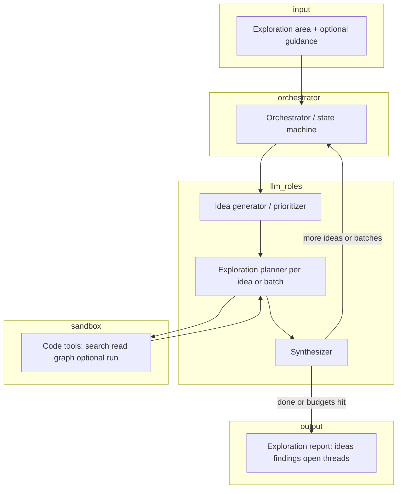

# Auto research agent — design (code exploration)

## 1. Purpose

An **auto research agent** runs **on top of a codebase**. The user specifies an **area to explore** (directory, package, subsystem, or natural-language scope). The agent is **LLM-driven**: it proposes and pursues up to **20 exploratory ideas**—hypotheses, threads, or questions about how that area works—then summarizes what it learned.

This is **not** a “grounded to external sources” system. Findings come from **reading and optionally executing code inside a sandbox**. The LLM may infer, speculate, and connect dots; the design prioritizes **useful exploration** and **clear attribution to code locations** (file/line/symbol) where the agent actually looked, not bibliographic grounding.

Success criteria:

- **Scoped**: Stays within (or clearly justifies stepping outside) the user’s exploration area.
- **Idea budget**: At most **20** tracked exploratory ideas per run unless the user raises the cap.
- **Follow-through**: Each idea gets a defined status (explored, deferred, blocked) and enough tool use to be meaningful—not only a one-line guess.
- **Sandbox safety**: No arbitrary host access; code effects confined to an isolated environment.
- **Batch-friendly**: Long-running exploration can be **split into batches** (time-sliced LLM calls, parallel workers, or queued jobs) without losing run state.

## 2. Non-goals (initial version)

- Proving correctness of the whole repo (this is exploration, not formal verification).
- Un-sandboxed execution on the developer’s machine.
- Guaranteeing completeness over the area—only systematic **attempts** within the idea and time budgets.

## 3. High-level architecture

**Orchestrator** owns the run: idea list (cap 20), batch scheduling, per-idea status, global budgets (time, tokens, tool calls), and persistence so a run can resume after a batch.

**LLM roles** (can be one model with different prompts, or split models):

- **Idea generator** — From the area + optional user guidance, proposes and ranks exploratory ideas; can merge or drop duplicates.
- **Exploration planner** — For the current idea (or a **batch** of ideas), chooses tool calls: where to read, what to search, whether to run something in the sandbox.
- **Synthesizer** — After tool results, updates notes for each idea and decides whether to deepen, move on, or spawn a follow-up idea (still under the 20 cap).

**Sandbox** exposes only **allowed tools** to the LLM; see §6.

## 4. Exploratory ideas (up to 20)

An **exploratory idea** is a short, actionable thread, for example:

- “How does authentication flow from HTTP handler to session store in `auth/`?”
- “What happens if `Config.reload` is called concurrently?”
- “Who implements `PaymentAdapter` and where is it wired in DI?”

Properties:

- **Guided mode**: User may supply seed ideas, forbidden paths, or “focus on performance / errors / API surface.”
- **Unguided mode**: LLM proposes all ideas from the area description.
- **Follow-up**: Completing one idea may add a **child** or **replacement** idea; the orchestrator enforces **max 20** active-or-completed idea slots per run (configurable).

**Batching**:

- **Within a batch**: One LLM call plans tool use for several ideas (e.g. shared grep across related hypotheses) to save round-trips.
- **Across batches**: A batch ends on token/time limits; state is saved; the next batch continues with the same `ResearchRun` id.

## 5. Core data model

| Concept | Role |
|--------|------|
| `ResearchRun` | One exploration: area spec, config, status, timestamps, batch cursor. |
| `ExplorationArea` | Roots (paths, packages), include/exclude globs, optional natural-language hint. |
| `ExploratoryIdea` | id, title, hypothesis, priority, status (`queued`, `in_progress`, `explored`, `blocked`, `skipped`), parent idea optional. |
| `ToolTrace` | Tool name, args summary, sandbox id, duration, stdout/stderr excerpt, linked idea ids. |
| `Finding` | Free-form LLM + human-readable summary; optional pointers to symbols/files/lines (what was **read**, not a claim of external truth). |
| `ExplorationReport` | Per-idea findings, global themes, open questions, “did not look at” notes. |

There is **no** requirement for a `Claim` ↔ `Evidence` graph tied to web citations. Optional: link findings to `ToolTrace` ids for **reproducibility** (“this note came after reading `foo.go:12–40`”).

## 6. Sandbox

Goals: **confine** what the agent can do while still allowing meaningful code exploration.

Recommended properties:

- **Filesystem**: Read-only mount of the **repository snapshot** (or copy) used for the run; optional writable **scratch** directory inside the sandbox only.
- **Network**: **Off** by default, or allowlist only what’s strictly needed (e.g. none for pure static exploration).
- **Execution**: If the agent runs tests, scripts, or small repro snippets, they run **inside** the sandbox with CPU/memory/time **cgroups** (or container equivalent) and **no** access to host secrets, SSH keys, or cloud metadata.
- **Determinism (best effort)**: Pinned tool versions, clear env vars, logged commands.

The LLM **never** receives raw shell; it issues **structured tool invocations** that the runtime validates and maps to sandboxed commands.

## 7. Tooling surface (code-first)

Typical tools (names illustrative):

1. **Find in codebase** — Ripgrep-like search scoped to `ExplorationArea`.
2. **Read file / range** — Bounded line or byte ranges to avoid huge dumps.
3. **List directory / module outline** — Summaries or tree within scope.
4. **Resolve symbol** — Jump to definition / references when backed by LSP or ctags (optional phase).
5. **Run in sandbox** — e.g. `go test ./pkg/foo -run TestBar -count=1` with timeout; capture output only.

Each tool call is recorded on the run for debugging and for “what we actually looked at” sections in the report.

## 8. Control flow and stopping

Stop when any of:

- All ideas are **explored**, **skipped**, or **blocked** (with reason).
- **Idea cap** reached and the synthesizer chooses to finalize.
- **Global budget** exhausted: wall-clock, LLM tokens, or tool calls.
- User **abort**.

Blocked ideas (e.g. binary-only dependency, missing sandbox image) should still appear in the report with explanation.

## 9. Configuration knobs

- `max_exploratory_ideas` (default **20**)
- `batch_max_tokens`, `batch_wall_clock_seconds`, `max_tool_calls_per_idea`
- Sandbox: CPU, memory, timeout per command, network policy
- `exploration_depth` (shallow outline vs deep traces)
- Guided vs unguided; optional user **seed ideas** list

## 10. Risks and mitigations

| Risk | Mitigation |
|------|------------|
| LLM invents file paths or APIs | Tools return errors; planner must reconcile; report distinguishes “observed” vs “inferred” |
| Prompt injection via repo content | Treat file contents as data; separate system policy; no instruction-following from files |
| Sandbox escape | Hardened container, no host mounts, no CAP_SYS_ADMIN, minimal image |
| Runaway cost | Hard caps on ideas, batches, and tool calls; resume requires explicit continuation if desired |
| Stale snapshot | Label report with commit SHA / snapshot id used for the run |

## 11. Implementation phases

1. **Skeleton** — `ResearchRun` + idea list + orchestrator loop; stub tools returning fake snippets; no sandbox yet (read-only local path with strict path validation as interim).
2. **Real code tools** — Scoped search + read + list; structured traces.
3. **Sandbox execution** — Container (or equivalent) for run commands; scratch workspace.
4. **Batching & resume** — Persist state between batches; optional parallel exploration of independent ideas with shared global budget.
5. **Polish** — Optional LSP/symbol tools; CLI or API; structured JSON report export.

## 12. Open decisions (to resolve during build)

- Sandbox technology (Docker, Podman, Firecracker, gVisor, etc.) vs “strict read-only + no exec” for v1.
- Single monolithic LLM thread vs **parallel** workers per idea (under a global semaphore).
- How much of the **20 ideas** to plan upfront vs discover incrementally.
- Report format: markdown for humans vs JSON for downstream agents.

---

This document is the baseline for implementation; adjust as the first prototype shows which tools and batch sizes matter most.
